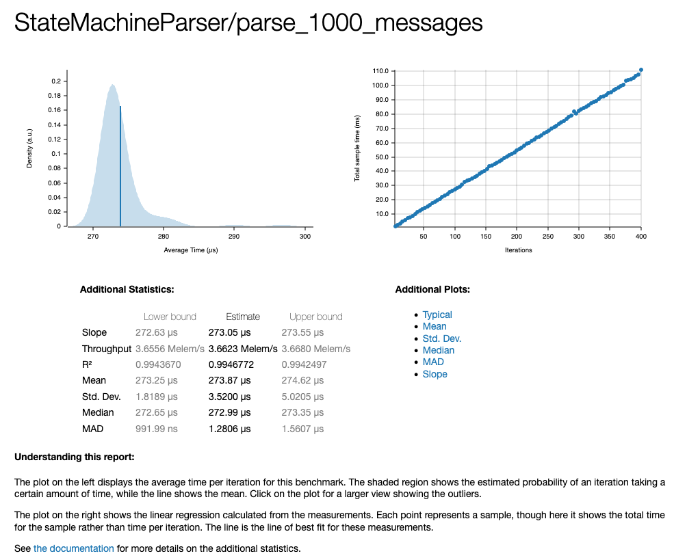

# Shift5 Binary Stream Parser

Here I've demonstrated building a binary stream parser according to Shift5's interview exercise. This project consists of the following components: a wire protocol, a state-machine parser, a TCP server that parses incoming streams, and a generator client that sends (and occasionally corrupts) message data.

## Components

### protocol

Defines the message type and wire format. A **Message** has:

- `address` (1 byte)
- `destination` (1 byte)
- `data` (0–255 bytes; `data_length` is derived)
- `checksum` (1 byte, computed from address, destination, data length, and data)

Messages are built with `Message::builder().address(...).destination(...).data(...).build()`; the builder computes `data_length` and `checksum`. Serialization is done with `Message::to_bytes() -> Vec<u8>` or `Message::write_bytes(&mut impl Write)`.

### parser

Parses a byte stream into `Message`s and errors. It exposes:

- **ParseResult**: `Complete(Message)` | `Partial` | `Error(ParseError)`
- **ParseError**: `ChecksumMismatch`, `InvalidEscapeSequence`, `Gap(n)`, `UnexpectedStartSequence`
- **Parser** trait: `feed(&mut self, input: &[u8]) -> Vec<ParseResult>`

The only implementation is **StateMachineParser**, a hand-written state machine that consumes bytes and maintains state across `feed()` calls so partial messages and resumption work correctly.

### server

Async TCP server that:

- Listens for connections (default `0.0.0.0:8080`).
- Spawns a task per client; each task reads bytes, feeds them to `StateMachineParser`, and updates per-client stats (messages, errors, bytes, connected).
- By default, periodically redraws a **stats table** (client address, message count, error count, byte count, connected). With **debug mode** (`-d`), the stats table is disabled and the server logs each parsed message and error instead.

### generator

TCP client that:

- Connects to the server and sends a stream of bytes produced by a **Generator** running on a background thread.
- The generator builds random `Message`s, serializes them, and sends them at a configurable rate. With a small probability it injects errors (wrong checksum, invalid escape bytes, or gap bytes) to exercise the parser’s error handling.

---

## Wire format

Each message on the wire is:

| Part           | Bytes | Description |
|----------------|-------|-------------|
| Start sequence | 2     | `[0xFF, 0x00]` — start of message |
| Address        | 1     | Single byte (escaped if `0xFF`) |
| Destination    | 1     | Single byte (escaped if `0xFF`) |
| Data length    | 1     | Number of data bytes (0–255) (escaped if `0xFF`) |
| Data           | N     | N = data length bytes (each `0xFF` escaped) |
| Checksum      | 1     | `u8` wrapping sum of address + destination + data_length + all data bytes (escaped if `0xFF`) |

**Escape rule:** Any logical `0xFF` outside the start sequence is encoded as two bytes `[0xFF, 0xFF]`. So:

- Start of message is uniquely `[0xFF, 0x00]`.
- A literal `0xFF` in address, destination, length, data, or checksum is sent as `0xFF 0xFF`.

**Checksum:** `address + destination + data_length + data[0] + ... + data[N-1]` (all `u8` wrapping add).

---

## Test cases

- **protocol**: Builder validation, serialization round-trip, escaping `0xFF` in fields.
- **parser** (`parser/tests/state_machine.rs`): State-machine parser behavior:
  - **Happy path:** empty input, single message, multiple messages, two feeds that form one message (first `Partial`, second `Complete`).
  - **Escaped value:** message with `0xFF` anywhere after the start sequence parses correctly.
  - **Partial at each state:** input split so the first feed ends in Address, Destination, DataLength, Data, or Checksum; second feed completes the message.
  - **InvalidEscapeSequence:** after start, a `0xFF` followed by a byte other than `0xFF` at address, destination, data length, data, or checksum.
  - **UnexpectedStartSequence:** a second `[0xFF, 0x00]` in the middle of a message at address, destination, data length, data, or checksum.
  - **Resume after escape:** first feed ends on the first `0xFF` of an escaped byte; second feed continues and completes the message.
  - **Gap:** bytes between two messages (Complete, Gap(n), Complete) and initial bytes before the first start sequence (Gap(n), Complete).

Run all tests:

```bash
cargo test
```

Run only parser state-machine tests:

```bash
cargo test -p parser --test state_machine
```

---

## Running the server and generator

**Release mode** (recommended for throughput):

1. Start the server:

   ```bash
   cargo run --release -p server
   ```

   Options (examples):

   - `--bind 0.0.0.0:8080` — listen on port 8080 (default)
   - `--debug` - print log messages instead of the stats table
   - `--stats-interval 1` — refresh the stats table every 1 second (default)

2. In another terminal, run the generator (connects to the server and streams data):

   ```bash
   cargo run --release -p generator
   ```

   Options (examples):

   - `--address 127.0.0.1:8080` — server address (default)
   - `--rate 1000` — target 1000 messages per second (default)
   - `--error-prob 0.001` — 0.1% chance of injecting an error (default)

### Server debug mode (logs instead of stats table)

To see logs for each parsed message and error instead of the stats table, run the server with **debug** and set the log level:

```bash
RUST_LOG=info cargo run --release -p server -- -d
```

- `-d` / `--debug`: disables the stats table and enables per-message/per-error logging in each client task.
- `RUST_LOG=info`: at least `info`-level to see connection events (e.g. "listening", "accepted", "disconnected") as well as parser warnings. Use `RUST_LOG=debug` to see every parsed message.

Then run the generator as usual:

```bash
cargo run --release -p generator
```

---

## Example server output

**Default (stats table):** the terminal is periodically cleared and the table is redrawn, for example:

```
Client Address          |   Messages |   Errors |        Bytes | Connected?
---------------------------------------------------------------------------
127.0.0.1:54321         |      1000 |         1 |         7500 |          X
```

**Debug mode** (`RUST_LOG=info cargo run --release -p server -- -d`), with generator connected, you’ll see logs like:

```
INFO server: listening bind=0.0.0.0:8080
INFO server: accepted connection addr=127.0.0.1:54321
DEBUG server: message addr=127.0.0.1:54321 msg=Message { ... }
WARN server: checksum mismatch addr=127.0.0.1:54321 expected=42 calculated=43
...
INFO server: disconnected addr=127.0.0.1:54321
```

(Exact format depends on `tracing` subscriber configuration.)

## Benchmarks

The parser crate includes a [Criterion](https://github.com/bheisler/criterion.rs) benchmark that serializes 1000 messages into a single buffer, then repeatedly parses that buffer with `StateMachineParser` to measure throughput.

Run the benchmark:

```bash
cargo bench -p parser
```

Sample output (MacBook Pro M2 Pro (2023), 16 GB RAM):

```
StateMachineParser/parse_1000_messages
                        time:   [272.63 µs 273.05 µs 273.55 µs]
                        thrpt:  [3.6556 Melem/s 3.6623 Melem/s 3.6680 Melem/s]
```

Throughput is reported in **Melem/s** (million elements per second); each “element” is 1000 messages, so ~3.66 Melem/s corresponds to about **3.66 million messages per second** for this workload.

Full report with plots and statistics is written to `target/criterion/report/index.html`. Example report on the same machine:



